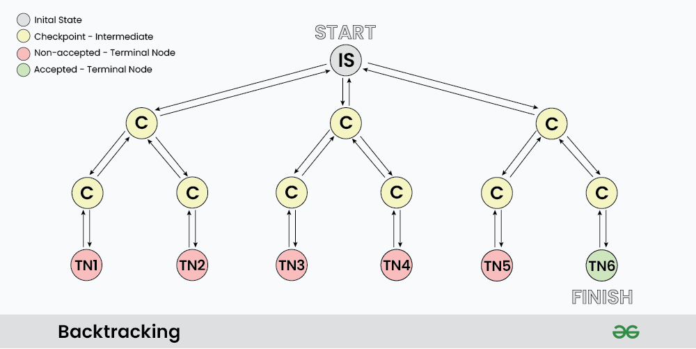

[39. Combination Sum](https://leetcode.com/problems/combination-sum/)

```go
func combinationSum(candidates []int, target int) [][]int {
    var res [][]int
    backtrack(candidates, target, 0, []int{}, &res)
    return res
}

func backtrack(candidates []int, target int, start int, combination []int, res *[][]int) {
    if target == 0 {
        // Make a copy of combination, because combination is reused in the recursion
        // and its content may change later.
        combinationCopy := make([]int, len(combination))
        copy(combinationCopy, combination)
        *res = append(*res, combinationCopy)
        return
    }

    for i := start; i < len(candidates); i++ { // i = start to avoid duplicate combinations
        if candidates[i] <= target {
            // Include the candidate and recurse with the remaining target.
            combination = append(combination, candidates[i])
            backtrack(candidates, target-candidates[i], i, combination, res)
            // Exclude the candidate and move on to the next candidate.
            combination = combination[:len(combination)-1]
        }
    }
}
```