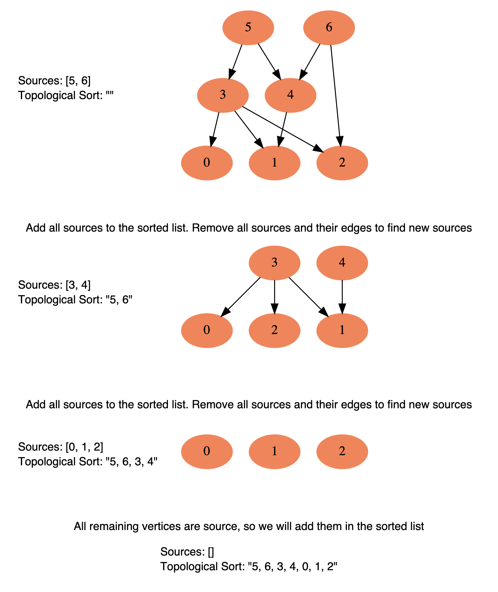

## Topological Sort

Topological Sorting can be viewed as a specific application of Breadth-First Search (BFS).

In a typical BFS, you traverse the graph level by level, starting from a certain node. However, in topological sorting, you start from nodes that have no incoming edges (in-degree of 0), i.e., no dependencies. These nodes are equivalent to the 'level 0' in BFS.

After visiting a node, you remove its edges, which is equivalent to decrementing the in-degrees of its adjacent nodes. If this results in any nodes having an in-degree of 0, they are added to the queue, just like how you would add the next level of nodes in a BFS.

So, while topological sorting uses a queue and has a similar flow to BFS, it's specifically designed to handle directed acyclic graphs and to provide a linear ordering of the nodes that respects the partial order that the edges give.

## About In-degree

In the context of topological sorting, the in-degree of a node represents the number of prerequisites or dependencies that node has. A node with an in-degree of 0 has no prerequisites, meaning it can be processed immediately without waiting for any other nodes.

When performing topological sorting, we start with nodes that have an in-degree of 0, because these nodes have no dependencies and can be processed right away. We add these nodes to the queue. 

As we process each node from the queue (i.e., remove it from the queue and add it to the sorted list), we also reduce the in-degree of its children by 1. This represents that one of their dependencies has been processed. If this causes any of the children to have an in-degree of 0, it means all of their dependencies have been processed, and they can now be processed as well. So, we add them to the queue.

The reason we decrease the in-degree of all its neighboring nodes by 1 is because once a node is processed, it's as if it no longer exists in the graph. Therefore, all the edges coming from this node to its neighboring nodes are removed. In terms of in-degrees, this is equivalent to decreasing the in-degree of each neighboring node by 1.

This is important because it may cause some neighboring nodes to have an in-degree of 0, meaning they have no more prerequisites left to be processed. These nodes can then be added to the queue to be processed next.

This process continues until the queue is empty, at which point all nodes have been processed and added to the sorted list in a way that respects their dependencies. If there are still nodes left with a non-zero in-degree, it means there's a cycle in the graph, and a topological sort is not possible.

## Philosophy Details

The basic idea behind the topological sort is to provide a partial ordering among the vertices of the graph such that if there is an edge from U to V then U≤V i.e., U comes before V in the ordering. Here are a few fundamental concepts related to topological sort:

Source: Any node that has no incoming edge and has only outgoing edges is called a source.

Sink: Any node that has only incoming edges and no outgoing edge is called a sink.

InDegree: "in-degree" of a node refers to the number of incoming edges to that node.

So, we can say that a topological ordering starts with one of the sources and ends at one of the sinks.

A topological ordering is possible only when the graph has no directed cycles, i.e. if the graph is a Directed Acyclic Graph (DAG). If the graph has a cycle, some vertices will have cyclic dependencies which makes it impossible to find a linear ordering among vertices.

To find the topological sort of a graph we can traverse the graph in a Breadth First Search (BFS) way. We will start with all the sources, and in a stepwise fashion, save all sources to a sorted list. We will then remove all sources and their edges from the graph. After the removal of the edges, we will have new sources, so we will repeat the above process until all vertices are visited.

Here is the visual representation of this algorithm:



This is how we can implement this algorithm:

a. Initialization

We will store the graph in Adjacency Lists, which means each parent vertex will have a list containing all of its children. We will do this using a HashMap where the ‘key’ will be the parent vertex number and the value will be a List containing children vertices.
To find the sources, we will keep a HashMap to count the in-degrees i.e., count of incoming edges of each vertex. Any vertex with ‘0’ in-degree will be a source.
b. Build the graph and find in-degrees of all vertices

We will build the graph from the input and populate the in-degrees HashMap.
c. Find all sources

All vertices with ‘0’ in-degrees will be our sources and we will store them in a Queue.
d. Sort

For each source, do the following things:
Add it to the sorted list.
Get all of its children from the graph.
Decrement the in-degree of each child by 1.
If a child’s in-degree becomes ‘0’, add it to the sources Queue.
Repeat step 1, until the source Queue is empty.

[207. Course Schedule](https://leetcode.com/problems/course-schedule/)

Topological Sort Pattern

```go
func canFinish(numCourses int, prerequisites [][]int) bool {
    // Step 1: Represent the courses and prerequisites as a directed graph
    graph := make([][]int, numCourses)
    inDegree := make([]int, numCourses)
    for _, pair := range prerequisites {
        graph[pair[1]] = append(graph[pair[1]], pair[0])
        inDegree[pair[0]]++
    }

    // Step 2: Initialize a queue to keep track of all nodes with no incoming edge
    queue := []int{}
    for i := 0; i < numCourses; i++ {
        if inDegree[i] == 0 {
            queue = append(queue, i)
        }
    }

    // Step 3: While the queue is not empty, remove a node from the queue, increment a count of visited nodes, and decrease the in-degree of all its neighboring nodes by 1
    count := 0
    for len(queue) != 0 {
        node := queue[0]
        queue = queue[1:]
        count++
        for _, neighbor := range graph[node] {
            inDegree[neighbor]--
            if inDegree[neighbor] == 0 {
                queue = append(queue, neighbor)
            }
        }
    }

    // Step 4: After the above process, if the count of visited nodes is equal to the total number of courses, return true. Otherwise, return false.
    return count == numCourses
}
```

The problem can be modeled as a directed graph where each course is a node and a prerequisite relationship is a directed edge. The problem then becomes finding if there's a cycle in the graph.

The visited array helps to avoid revisiting nodes that we've already confirmed don't form a cycle, while the recStack array helps to detect cycles by checking if we're revisiting a node within the same DFS traversal.

```go
func canFinish(numCourses int, prerequisites [][]int) bool {
    graph := make([][]int, numCourses)
    for _, pair := range prerequisites {
        graph[pair[1]] = append(graph[pair[1]], pair[0])
    }

    visited := make([]bool, numCourses)
    recStack := make([]bool, numCourses)

    for i := 0; i < numCourses; i++ {
        if visited[i] == false {
            if isCyclic(i, visited, recStack, graph) {
                return false
            }
        }
    }
    return true
}

func isCyclic(v int, visited []bool, recStack []bool, graph [][]int) bool {
    visited[v] = true
    recStack[v] = true

    for _, node := range graph[v] {
        if visited[node] == false {
            if isCyclic(node, visited, recStack, graph) {
                return true
            }
        } else if recStack[node] {
            return true
        }
    }

    recStack[v] = false // backtracking
    return false
}
```

[210. Course Schedule II](https://leetcode.com/problems/course-schedule-ii/)

```go
func findOrder(n int, pre [][]int) []int {
    graph := make([][]int, n)
    inDegree := make([]int, n)
    res := []int{}

    for _, pair := range pre {
        graph[pair[1]] = append(graph[pair[1]], pair[0])
        inDegree[pair[0]]++
    }

    queue := []int{}
    for i := 0; i < n; i++ {
        if inDegree[i] == 0 {
            queue = append(queue, i)
        }
    }

    for len(queue) > 0 {
        node := queue[0]
        queue = queue[1:]
        res = append(res, node)

        for _, neighbor := range graph[node] {
            inDegree[neighbor]--
            if inDegree[neighbor] == 0 {
                queue = append(queue, neighbor)
            }
        }
    }
    if len(res) == n {
        return res
    }
    return []int{}
}
```

[269. Alien Dictionary](https://leetcode.com/problems/alien-dictionary/)

In the context of the Alien Dictionary problem, a node with in-degree == 0 is a character that does not come after any other character in the alien language.

```go
words := []string{"wrt", "wrf", "er", "ett", "rftt"}
```
In this case, the character 'w' is a node with in-degree == 0. This is because 'w' does not come after any other character in the words list. It always appears before other characters ('r' and 't').


```go
func alienOrder(words []string) string {
    graph := make(map[byte][]byte)
    degree := make(map[byte]int)
    for _, word := range words {
        for i := 0; i < len(word); i++ {
            graph[word[i]] = []byte{}
            degree[word[i]] = 0
        }
    }

    for i := 0; i < len(words)-1; i++ {
        cur := words[i]
        next := words[i+1]
        length := min(len(cur), len(next))
        for j := 0; j < length; j++ {
            if cur[j] != next[j] {
                graph[cur[j]] = append(graph[cur[j]], next[j])
                degree[next[j]]++
                break
            }
        }
    }

    queue := []byte{}
    for b, d := range degree {
        if d == 0 {
            queue = append(queue, b)
        }
    }

    var res []byte
    for len(queue) > 0 {
        b := queue[0]
        queue = queue[1:]
        res = append(res, b)
        for _, next := range graph[b] {
            degree[next]--
            if degree[next] == 0 {
                queue = append(queue, next)
            }
        }
    }

    // determine if there is a cycle in the graph.
    if len(res) != len(degree) {
        return ""
    }

    return string(res)
}

func min(a, b int) int {
    if a < b {
        return a
    }
    return b
}
```

len(res) represents the number of nodes that have been processed (i.e., added to the result string), and len(degree) represents the total number of nodes in the graph.

```go
import "container/list"

func alienOrder(words []string) string {
    graph := make(map[byte]*list.List)
    degree := make(map[byte]int)
    for _, word := range words {
        for i := 0; i < len(word); i++ {
            graph[word[i]] = list.New()
            degree[word[i]] = 0
        }
    }

    for i := 0; i < len(words)-1; i++ {
        cur := words[i]
        next := words[i+1]
        length := min(len(cur), len(next))
        for j := 0; j < length; j++ {
            if cur[j] != next[j] {
                graph[cur[j]].PushBack(next[j])
                degree[next[j]]++
                break
            }
        }
    }

    queue := list.New()
    for b, d := range degree {
        if d == 0 {
            queue.PushBack(b)
        }
    }

    var res []byte
    for queue.Len() > 0 {
        b := queue.Remove(queue.Front()).(byte)
        res = append(res, b)
        for e := graph[b].Front(); e != nil; e = e.Next() {
            next := e.Value.(byte)
            degree[next]--
            if degree[next] == 0 {
                queue.PushBack(next)
            }
        }
    }

    if len(res) != len(degree) {
        return ""
    }

    return string(res)
}

func min(a, b int) int {
    if a < b {
        return a
    }
    return b
}
```
