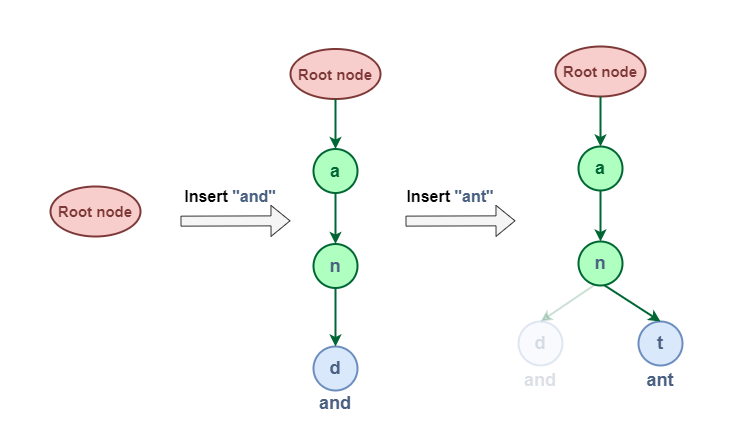
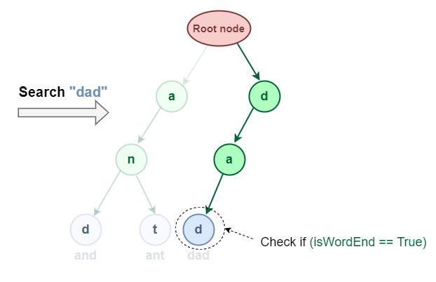
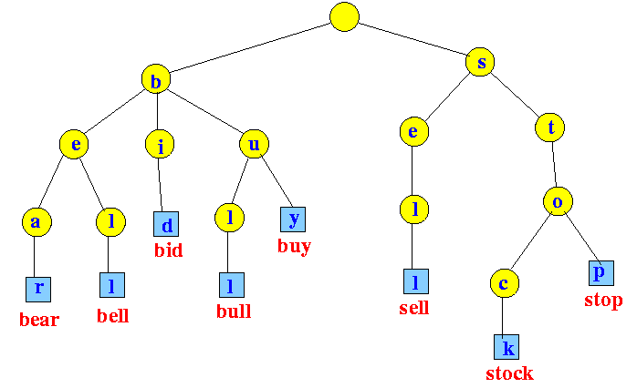

[208. Implement Trie (Prefix Tree)](https://leetcode.com/problems/implement-trie-prefix-tree/)

```go

```

The time and space complexity of operations in a Trie data structure are as follows:

Insertion: The time and space complexity for inserting a word into a Trie is O(k), where k is the length of the word. This is because in the worst case, we need to add k nodes to the Trie, which takes O(k) time and space.

Search: The time complexity for searching a word in a Trie is also O(k), where k is the length of the word. This is because in the worst case, we need to traverse down the Trie until we reach the end of the word. The space complexity for searching is O(1), as we're not using any additional space proportional to the input.

Prefix Search: The time complexity for searching a prefix in a Trie is O(k), where k is the length of the prefix. Similar to the search operation, we need to traverse down the Trie until we reach the end of the prefix. The space complexity is O(1).

The space complexity of a Trie in general is O(n), where n is the total number of characters in all words inserted into the Trie. This is because each node in the Trie represents a character.