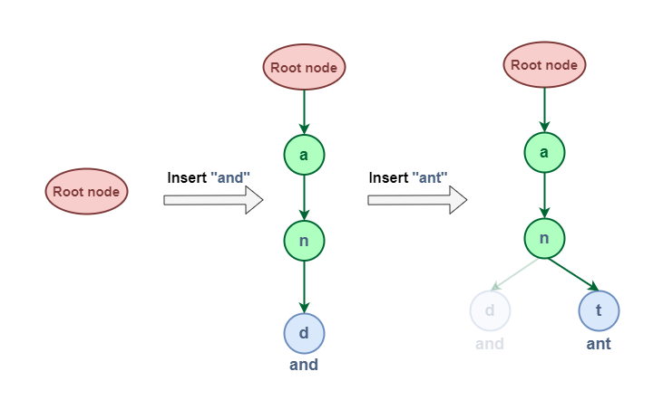

[208. Implement Trie (Prefix Tree)](https://leetcode.com/problems/implement-trie-prefix-tree/)

In ASCII, 'A' is 65 and 'B' is 66. So, 'B' - 'A' equals 1.

Similarly, in ASCII, 'a' is 97 and 'b' is 98. So, 'b' - 'a' also equals 1.

```go
type Trie struct {
    children [26]*Trie
    isEnd bool
}


func Constructor() Trie {
    return Trie{}
}


func (this *Trie) Insert(word string)  {
    node := this
    for _, ch := range word {
        ch -= 'a'
        if node.children[ch] == nil {
            node.children[ch] = &Trie{}
        }
        node = node.children[ch]
    }
    node.isEnd = true
}


func (this *Trie) Search(word string) bool {
    node := this
    for _, ch := range word {
        ch -= 'a'
        if node.children[ch] == nil {
            return false
        }
        node = node.children[ch]
    }
    return node.isEnd
}


func (this *Trie) StartsWith(prefix string) bool {
    node := this
    for _, ch := range prefix {
        ch -= 'a'
        if node.children[ch] == nil {
            return false
        }
        node = node.children[ch]
    }
    return true
}
```

Modification: word contains both upper and lower case letters

```go
type Trie struct {
    children [52]*Trie
    isEnd bool
}

func Constructor() Trie {
    return Trie{}
}

func (this *Trie) Insert(word string)  {
    node := this
    for _, ch := range word {
        ch = toIndex(ch)
        if node.children[ch] == nil {
            node.children[ch] = &Trie{}
        }
        node = node.children[ch]
    }
    node.isEnd = true
}

func (this *Trie) Search(word string) bool {
    node := this
    for _, ch := range word {
        ch = toIndex(ch)
        if node.children[ch] == nil {
            return false
        }
        node = node.children[ch]
    }
    return node.isEnd
}

func (this *Trie) StartsWith(prefix string) bool {
    node := this
    for _, ch := range prefix {
        ch = toIndex(ch)
        if node.children[ch] == nil {
            return false
        }
        node = node.children[ch]
    }
    return true
}

// Helper function to convert a rune to an index in the children array.
// It maps 'a'-'z' to 0-25 and 'A'-'Z' to 26-51.
func toIndex(ch rune) int {
    if 'a' <= ch && ch <= 'z' {
        return int(ch - 'a')
    } else {
        return int(ch - 'A') + 26
    }
}

/**
 * Your Trie object will be instantiated and called as such:
 * obj := Constructor();
 * obj.Insert(word);
 * param_2 := obj.Search(word);
 * param_3 := obj.StartsWith(prefix);
 */
```

[211. Design Add and Search Words Data Structure](https://leetcode.com/problems/design-add-and-search-words-data-structure/)

```go
type Trie struct {
    children map[rune]*Trie
    isEnd bool
}

type WordDictionary struct {
    root *Trie
}


func Constructor() WordDictionary {
    return WordDictionary{
        root: &Trie{
            children: make(map[rune]*Trie),
        },
    }
}


func (this *WordDictionary) AddWord(word string)  {
    node := this.root
    for _, ch := range word {
        if _, ok := node.children[ch]; !ok {
            node.children[ch] = &Trie{
                children: make(map[rune]*Trie),
            }
        }
        node = node.children[ch]
    }
    node.isEnd = true
}


func (this *WordDictionary) Search(word string) bool {
    return this.SearchTrie(word, this.root)
}

func (this *WordDictionary) SearchTrie(word string, node *Trie) bool {
    for i, ch := range word {
        if ch != '.' {
            if _, ok := node.children[ch]; !ok {
                return false
            }
            node = node.children[ch]
        } else {
            for _, child := range node.children {
                if this.SearchTrie(word[i+1:], child) {
                    return true
                }   
            }
            return false
        }
    }
    return node.isEnd
}

/**
 * Your WordDictionary object will be instantiated and called as such:
 * obj := Constructor();
 * obj.AddWord(word);
 * param_2 := obj.Search(word);
 */

```

The time and space complexity of operations in a Trie data structure are as follows:

Insertion: The time and space complexity for inserting a word into a Trie is O(k), where k is the length of the word. This is because in the worst case, we need to add k nodes to the Trie, which takes O(k) time and space.

Search: The time complexity for searching a word in a Trie is also O(k), where k is the length of the word. This is because in the worst case, we need to traverse down the Trie until we reach the end of the word. The space complexity for searching is O(1), as we're not using any additional space proportional to the input.

Prefix Search: The time complexity for searching a prefix in a Trie is O(k), where k is the length of the prefix. Similar to the search operation, we need to traverse down the Trie until we reach the end of the prefix. The space complexity is O(1).

The space complexity of a Trie in general is O(n), where n is the total number of characters in all words inserted into the Trie. This is because each node in the Trie represents a character.

[212. Word Search II](https://leetcode.com/problems/word-search-ii/description/)

```go
type Trie struct {
    children [26]*Trie
    word string
}

func findWords(board [][]byte, words []string) []string {
    root := &Trie{}
    for _, word := range words {
        node := root
        for _, ch := range word {
            ch -= 'a'
            if node.children[ch] == nil {
                node.children[ch] = &Trie{}
            }
            node = node.children[ch]
        }
        node.word = word
    }
    
    res := make([]string, 0)
    for i := 0; i < len(board); i++ {
        for j := 0; j < len(board[0]); j++ {
            dfs(board, i, j, root, &res)
        }
    }
    return res
}

func dfs(board [][]byte, i, j int, node *Trie, res *[]string) {
    if i < 0 || i >= len(board) || j < 0 || j >= len(board[0]) {
        return
    }
    ch := board[i][j]
    if ch == '#' || node.children[ch-'a'] == nil {
        return
    }
    node = node.children[ch-'a']
    if node.word != "" {
        *res = append(*res, node.word)
        node.word = ""
    }
    board[i][j] = '#'
    dfs(board, i+1, j, node, res)
    dfs(board, i-1, j, node, res)
    dfs(board, i, j+1, node, res)
    dfs(board, i, j-1, node, res)
    board[i][j] = ch //backtracking
}
```
