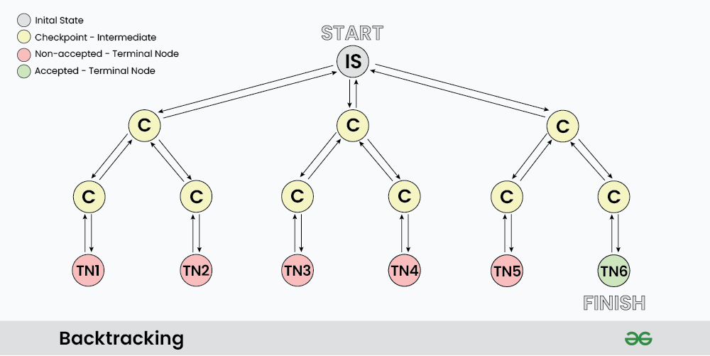

use i := 0 when the order of elements matters (permutations), and use i := start when the order does not matter (combinations).

[78. Subsets](https://leetcode.com/problems/subsets/description/)

The for loop and the subsetCopy code interact in the following way:

At the start of each iteration of the for loop, an element from nums is appended to subset.

The backtrack function is then called recursively with this updated subset. Inside this recursive call, a new subsetCopy is created which is a snapshot of subset at that point in time. This subsetCopy is then appended to res.

After the recursive call to backtrack, the last element is removed from subset (this is the backtracking step). This does not affect subsetCopy in the recursive call, because subsetCopy was a separate copy of subset.

The for loop then moves on to the next element in nums, and the process repeats.

So, in each iteration of the for loop, subset is modified and a snapshot of it is captured in subsetCopy inside a recursive call to backtrack. The modifications to subset in the for loop do not affect the subsetCopy that was created in previous recursive calls, because each subsetCopy is a separate slice that was created with the state of subset at the time of its creation.

time O(N * 2^N), space O(N * 2^N)

```go
func subsets(nums []int) [][]int {
    var res [][]int
    backtrack(nums, 0, []int{}, &res)
    return res
}

func backtrack(nums []int, start int, subset []int, res *[][]int) {
    subsetCopy := make([]int, len(subset))
    copy(subsetCopy, subset)
    *res = append(*res, subsetCopy)
    for i := start; i < len(nums); i++ {
        subset = append(subset, nums[i])
        backtrack(nums, i+1, subset, res)
        subset = subset[:len(subset)-1]
    }
}
```

How duplicate subset is skipped?

In the backtrack function, the loop variable i starts from the start index and goes up to the end of nums. This means that for each subset, it only considers the current element and the elements after it. It does not consider the elements before the current element.

So, when nums is [1,2,3], it first considers 1, and then it considers 2 and 3. But when it's considering 2 and 3, it does not go back and consider 1 again. This means it generates [1,2] but not [2,1].

[39. Combination Sum](https://leetcode.com/problems/combination-sum/)

```go
func combinationSum(candidates []int, target int) [][]int {
    var res [][]int
    backtrack(candidates, target, 0, []int{}, &res)
    return res
}

func backtrack(candidates []int, target int, start int, combination []int, res *[][]int) {
    if target == 0 {
        // Make a copy of combination, because combination is reused in the recursion
        // and its content may change later.
        combinationCopy := make([]int, len(combination))
        copy(combinationCopy, combination)
        *res = append(*res, combinationCopy)
        return
    }

    for i := start; i < len(candidates); i++ { // i = start to avoid duplicate combinations
        if candidates[i] <= target {
            // Include the candidate and recurse with the remaining target.
            combination = append(combination, candidates[i])
            backtrack(candidates, target-candidates[i], i, combination, res)
            // Exclude the candidate and move on to the next candidate.
            combination = combination[:len(combination)-1]
        }
    }
}
```

The time complexity of the combinationSum function is O(N^(T/M)) where N is the number of candidates, T is the target value, and M is the minimum value in candidates. This is because in the worst case, the function explores each possible combination of candidates. The exponent T/M comes from the fact that each recursive step decreases the target value by at least M, and there can be at most T/M recursive calls.

The space complexity of the function is O(T/M) because in the worst case, if every candidate is chosen, the maximum depth of the recursion tree can be T/M. This is the maximum size of the combination array, which is stored in the call stack during the recursion.

[46. Permutations](https://leetcode.com/problems/permutations/description/)

```go
func permute(nums []int) [][]int {
    var res [][]int
    backtrack(nums, []int{}, &res)
    return res
}

func backtrack(nums []int, permutation []int, res *[][]int) {
    if len(permutation) == len(nums) {
        permutationCopy := make([]int, len(permutation))
        copy(permutationCopy, permutation)
        *res = append(*res, permutationCopy)
        return
    }
    for i := 0; i < len(nums); i++ {
        if contains(permutation, nums[i]) {
            continue
        }
        permutation = append(permutation, nums[i])
        backtrack(nums, permutation, res)
        permutation = permutation[:len(permutation)-1]
    }
}

func contains(arr []int, num int) bool {
    for _, n := range arr {
        if n == num {
            return true
        }
    }
    return false
}
```

c := []int{} followed by copy(c, subset) results in c remaining an empty slice

In the 46. Permutations problem, we are asked to return all possible permutations of a given list. In a permutation, each element can appear in any position, and the order of elements matters. Therefore, for each recursive call, we start from the beginning of the list (i.e., i := 0) because any of the remaining elements could be the next element in the permutation.

On the other hand, in the 39. Combination Sum and 78. Subsets problems, we are dealing with combinations. In a combination, the order of elements does not matter. To avoid duplications and to ensure that each combination is unique, we start from the current element or the next one (i.e., i := start) in each recursive call. This way, we ensure that we only consider each element once for each specific position in the combination.

[79. Word Search](https://leetcode.com/problems/word-search/)

```go
func exist(board [][]byte, word string) bool {
    for i := 0; i < len(board); i++ {
        for j := 0; j < len(board[0]); j++ {
            if backtrack(board, word, i, j, 0) {
                return true
            }
        }
    }
    return false
}

func backtrack(board [][]byte, word string, row, col, idx int) bool{
    if idx == len(word) {
        return true
    }
    if row >= len(board) || row < 0 || col >= len(board[0]) || col < 0 || board[row][col] != word[idx] {
        return false
    }
    temp := board[row][col]
    board[row][col] = '#'
    dirs := [][]int{{-1, 0}, {1, 0}, {0, -1}, {0, 1}}
    for _, dir := range dirs {
        if backtrack(board, word, row+dir[0], col+dir[1], idx+1) {
            return true
        }
    }
    board[row][col] = temp
    return false
}
```

The time complexity of the exist function is O(N * 4^L), where N is the total number of cells in the board and L is the length of the word. This is because in the worst case, the function needs to explore all four directions for each character in the word, for each cell in the board.

The space complexity of the function is O(L), where L is the length of the word. This is because in the worst case, if the word is found, the maximum depth of the recursion (and hence the maximum size of the call stack) can be the length of the word. The space complexity also accounts for the space required to store the word.

[22. Generate Parentheses](http://leetcode.com/problems/generate-parentheses/)

The solution for generating parentheses is often referred to as a backtracking solution because it builds candidates for the solution incrementally and abandons a candidate ("backtracks") as soon as it determines that the candidate cannot possibly be extended to a valid solution.

```go
func generateParenthesis(n int) []string {
    var res []string
    backtrack(n, n, "", &res)
    return res
}

func backtrack(left, right int, path string, res *[]string) {
    if left == 0 && right == 0 {
        *res = append(*res, path)
        return
    }
    if left > 0 {
        backtrack(left-1, right, path+"(", res)
    }
    if right > left {
        backtrack(left, right-1, path+")", res)
    }
}
```

The time complexity of the generateParenthesis function is O(4^n/sqrt(n)), where n is the given number n. This is the Nth Catalan number, which is the number of valid parentheses strings with n pairs of parentheses. The time complexity is determined by the number of recursive calls, which is the Nth Catalan number.

The function is generating all valid combinations of n pairs of parentheses. In the worst case, it's similar to generating all combinations of 2n bits (since a pair of parentheses can be thought of as an opening bit and a closing bit), which would be 2^(2n) or 4^n combinations.

The sqrt(n) factor in the denominator is a result of the Catalan number sequence, which counts the number of valid parentheses expressions.

The first few Catalan numbers for n = 0, 1, 2, 3, ... are 1, 1, 2, 5, 14, 42, 132, .... The nth Catalan number is given by the formula C(n) = (2n)! / ((n + 1)! * n!).

The space complexity of the generateParenthesis function is O(n), where n is the input to the function.

Here's why:

The res slice that stores the results will, in the worst case, contain all valid combinations of parentheses. The number of valid combinations is given by the nth Catalan number, which is O(4^n / sqrt(n)). However, we only count the number of strings (combinations), not the total size of these strings. So, the res slice contributes O(1) to the space complexity.

The path string that is built up during the recursion can have a maximum length of 2n (n opening parentheses and n closing parentheses). This string is built up and torn down during the recursion, but at any given time, the maximum length is 2n. So, the path string contributes O(n) to the space complexity.

The recursion stack can go as deep as 2n (in the case where we add n opening parentheses and then n closing parentheses). Each recursive call adds a new layer to the stack. So, the recursion stack contributes O(n) to the space complexity.

Adding these up, the total space complexity is O(n).


